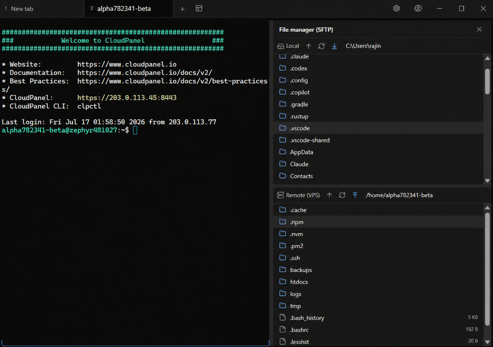

# Moorix

> **One Workspace for Every Server.**

Stop switching between **PuTTY**, **FileZilla**, **VS Code**, and password notes.

**Moorix** is an all-in-one desktop workspace for managing VPS, dedicated servers, and cloud instances. It combines an SSH terminal, dual-pane SFTP, a built-in code editor, an encrypted credential vault, port forwarding, and cloud synchronization into a single fast, lightweight application.




---

## Why Moorix?

Managing servers usually looks like this:

- Open PuTTY for SSH
- Open FileZilla for SFTP
- Open VS Code to edit files
- Open Notes to find passwords
- Repeat for every server

Switching between applications wastes time.

**Moorix brings everything together in one modern desktop application.**

---

## Features

### Remote Access

- **SSH terminal** — password & private key auth, host-key verification (TOFU)
- **Telnet & Serial** transports (Serial on desktop)
- **Port forwarding** — Local (`-L`) and Dynamic / SOCKS5 (`-D`)
- **Multi-tab, split panes, and auto-reconnect**

### File Management (SFTP)

- **FileZilla-style dual-pane** (local ↔ remote)
- **Drag & drop** — in-app and from your OS
- **Recursive upload / download** with progress & cancel
- **Right-click actions** — compress/extract ZIP, rename, SHA-256 checksum, "Open in Terminal"
- **Last-modified timestamps**

### Remote Editing

- **Built-in Monaco (VS Code) editor** — edit and save remote files in place
- **Multi-file tabs, split view, and minimize-to-dock**
- **Syntax highlighting** — no more download-edit-reupload

### Security

- **Encrypted credential vault** (AES-GCM) protected by a master password
- **OS keychain integration** — Windows Credential Manager / macOS Keychain / Linux Secret Service
- Passwords & private keys never stored in plaintext config

### Productivity

- **Cross-device sync via Google Drive** — end-to-end encrypted, auto-sync in the background
- **17+ themes** (Nord, Gruvbox, Catppuccin, and more) + custom keybindings
- **Silent auto-update** — always on the latest version
- **Cross-platform** and lightweight

---

## Platform Support

| Platform | Release | Local shell | SSH / Telnet / Serial | SFTP | Code Editor |
|---|---|---|---|---|---|
| Windows / Linux / macOS | ✅ Available | ✅ native PTY | ✅ | ✅ | ✅ |
| Android / iOS | 🚧 Planned | ❌ (OS limitation) | ✅ SSH-only | — | — |

---

## Comparison

| Feature | Moorix | PuTTY | FileZilla | VS Code Remote |
|---------|:------:|:------:|:----------:|:---------------:|
| SSH Terminal | ✅ | ✅ | ❌ | ✅ |
| Dual-pane SFTP | ✅ | ❌ | ✅ | ❌ |
| Built-in Editor | ✅ | ❌ | ❌ | ✅ |
| Credential Vault | ✅ | ❌ | ❌ | ❌ |
| Port Forwarding | ✅ | ✅ | ❌ | ✅ |
| Everything in one application | ✅ | ❌ | ❌ | ❌ |

---

## Quick Start

> **⬇️ Try it now — free:** grab the installer for Windows (`.exe`), macOS (`.dmg`), or Linux (`.AppImage`/`.deb`) from the **[Releases](https://github.com/oktajianto/Moorix/releases/latest)** page, install in seconds, and feel the difference of managing your VPS from a single window. Your server will never feel far away again.

---

## Tech Stack

- **Backend:** Rust + Tauri 2 (`russh`, `portable-pty`, `serialport`)
- **Frontend:** React + TypeScript + Vite + Tailwind CSS
- **Terminal rendering:** xterm.js
- **Code editing:** Monaco Editor
- **Package manager:** pnpm

---

## Development

Prerequisites: **Rust** (stable) + cargo, **Node.js** LTS + pnpm, and on Windows the **VS C++ Build Tools** + **WebView2**.

```bash
pnpm install

# Desktop (dev)
pnpm tauri dev

# Build desktop
pnpm tauri build
```

**Recommended IDE:** [VS Code](https://code.visualstudio.com/) + [Tauri](https://marketplace.visualstudio.com/items?itemName=tauri-apps.tauri-vscode) + [rust-analyzer](https://marketplace.visualstudio.com/items?itemName=rust-lang.rust-analyzer).

---

## Roadmap

**Completed**

- ✅ SSH terminal — multi-tab, split panes, auto-reconnect
- ✅ Dual-pane SFTP
- ✅ Remote file editor (Monaco, multi-file)
- ✅ Encrypted credential vault
- ✅ Google Drive cloud sync
- ✅ Port forwarding (Local + Dynamic/SOCKS5)
- ✅ Database manager (MySQL/MariaDB + PostgreSQL) — browse, SQL editor, edit rows, structure editing, export/import

**Planned**

- Docker manager
- PM2 manager
- Redis browser
- Nginx configuration manager
- Team collaboration

---

## Why Developers Choose Moorix

- Modern desktop experience
- Fast and lightweight (Rust + Tauri)
- Everything in one workspace
- Secure credential storage
- Built for developers, DevOps engineers, and system administrators

---

## License

Proprietary — © 2026 Hammam Oktajianto. All rights reserved. See [LICENSE](./LICENSE).

This source code may be viewed for reference, but **may not** be copied, modified, or distributed without written permission.

---

## Support the Project

If Moorix helps your workflow:

- ⭐ Star this repository
- 🐞 Report bugs
- 💡 Suggest new features
- 🤝 Share Moorix with other developers

---

**One Workspace for Every Server.**
